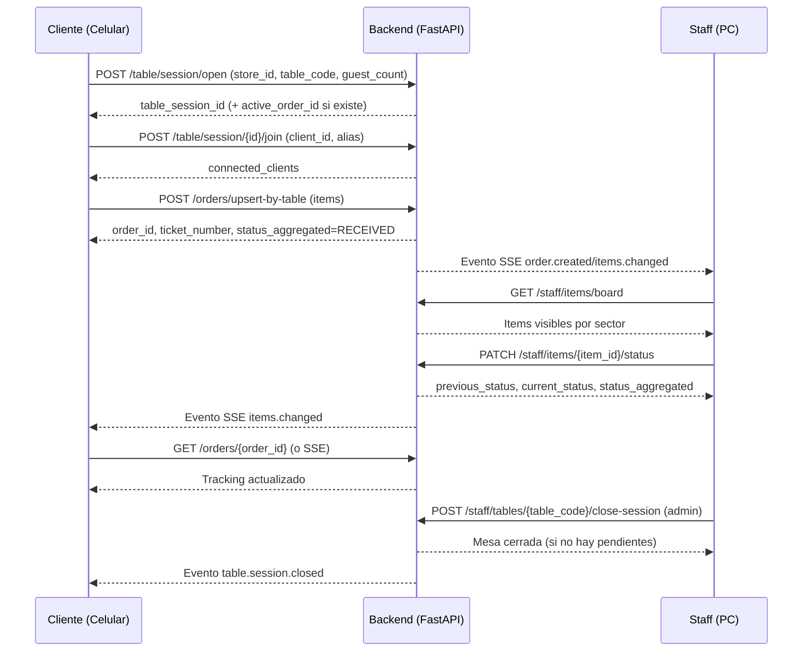

# COMANDA - Diagrama de Flujo de Pedidos (MVP)

Fecha: 2026-02-19
Estado: activo

## 1) Flujo principal (end-to-end)

```mermaid
flowchart TD
    A[Cliente abre app en celular] --> B[Ingresa mesa y comensales]
    B --> C[POST /table/session/open]
    C --> D{Mesa valida y activa?}
    D -- No --> E[Error: mesa inexistente/inactiva]
    D -- Si --> F[Sesion de mesa abierta/reutilizada]

    F --> G[Cliente arma carrito]
    G --> H[POST /orders/upsert-by-table]
    H --> I{Hay pedido activo de esa mesa?}
    I -- No --> J[Crear pedido nuevo + ticket_number]
    I -- Si --> K[Agregar items al pedido existente]

    J --> L[Enrutar items por sector]
    K --> L
    L --> M[Items en estado RECEIVED]
    M --> N[Publicar eventos tiempo real]

    N --> O[Staff ve pedido en tablero]
    O --> P[Staff cambia estado de items]
    P --> Q[PATCH /staff/items/{item_id}/status]
    Q --> R{Transicion permitida y rol autorizado?}
    R -- No --> S[Error 400/403]
    R -- Si --> T[Guardar evento + recalcular estado agregado]

    T --> U[Cliente ve tracking actualizado]
    U --> V{Pedido totalmente DELIVERED?}
    V -- No --> O
    V -- Si --> W[Admin puede cerrar mesa]
    W --> X[POST /staff/tables/{table_code}/close-session]
```

## 2) Secuencia entre actores



## 3) Estados operativos

```txt
RECEIVED -> IN_PROGRESS -> DONE -> DELIVERED
```

Notas:
- El cambio de estado se hace a nivel item.
- El estado agregado del pedido se recalcula automaticamente.
- Si una mesa tiene pedido activo, nuevos items se agregan al pedido existente.
