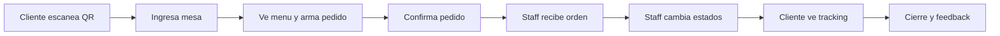

# COMANDA - Presentacion Ejecutiva

Fecha: 2026-05-11
Audiencia sugerida:
- dueno o socio de restaurante
- encargado operativo
- persona no tecnica

Objetivo:
- explicar que problema resuelve COMANDA
- mostrar el flujo de punta a punta
- bajar el valor a beneficios faciles de entender
- cerrar con demo o video corto

Activos visuales disponibles:
- mockups mobile en [App_Comanda_V2.pdf](/C:/Users/agust/Desktop/COMANDA_LOCAL/docs/App_Comanda_V2.pdf)
- mockups exportados en [docs/APP mockup](/C:/Users/agust/Desktop/COMANDA_LOCAL/docs/APP%20mockup)
- wireframe staff en [staff-menu-editor-wireframe.svg](/C:/Users/agust/Desktop/COMANDA_LOCAL/docs/mockups/staff-menu-editor-wireframe.svg)
- flujo tecnico en [DIAGRAMA_FLUJO_PEDIDOS_MVP.md](/C:/Users/agust/Desktop/COMANDA_LOCAL/docs/DIAGRAMA_FLUJO_PEDIDOS_MVP.md)

Nota:
- no hay un video ya exportado dentro del repo
- si queres grabarlo, al final hay un guion de demo y el comando de captura

## Slide 1 - Portada

Titulo:
`COMANDA`

Subtitulo:
`Mas orden en la operacion. Menos errores en el servicio. Mejor experiencia en cada mesa.`

Decir:
`COMANDA conecta la mesa con la operacion del local. El cliente pide desde su celular, el equipo recibe mejor la orden y todos ganan visibilidad durante el servicio.`

Visual sugerido:
- usar [App_Comanda_V2.pdf](/C:/Users/agust/Desktop/COMANDA_LOCAL/docs/App_Comanda_V2.pdf) como imagen principal de tapa
- o una portada simple con 3 celulares del PDF

## Slide 2 - El problema

Titulo:
`Que pasa hoy en muchos locales`

Bullets:
- pedidos mal tomados o repetidos
- tiempos poco claros para el cliente
- personal resolviendo sobre la marcha
- poca trazabilidad de que esta pasando en cada mesa

Decir:
`El problema no es solo tomar el pedido. El problema real es el desorden operativo: la mesa espera, el equipo se interrumpe y el servicio pierde claridad.`

Visual sugerido:
- pantalla de bienvenida QR [App_Comanda_V2_page-0004.jpg](/C:/Users/agust/Desktop/COMANDA_LOCAL/docs/APP%20mockup/App_Comanda_V2_page-0004.jpg)
- a un costado, texto corto con el problema operativo

## Slide 3 - La solucion

Titulo:
`Que hace COMANDA`

Bullets:
- el cliente entra por QR
- elige mesa y arma su pedido
- el local recibe la orden mejor organizada
- el staff actualiza estados en vivo
- el cliente sigue el pedido sin incertidumbre

Decir:
`COMANDA no es solo un menu QR. Es una forma de ordenar el servicio desde la mesa hasta la operacion interna.`

Visual sugerido:
- menu cliente [App_Comanda_V2_page-0007.jpg](/C:/Users/agust/Desktop/COMANDA_LOCAL/docs/APP%20mockup/App_Comanda_V2_page-0007.jpg)
- pedido/resumen [App_Comanda_V2_page-0008.jpg](/C:/Users/agust/Desktop/COMANDA_LOCAL/docs/APP%20mockup/App_Comanda_V2_page-0008.jpg)

## Slide 4 - Flujo completo

Titulo:
`Flujo punta a punta`



Decir:
`La gracia del sistema es que el flujo es lineal y facil de entender: entra el cliente, se genera el pedido, el equipo lo procesa y el cliente ve el avance.`

Visual apoyo:
- complementar con [DIAGRAMA_FLUJO_PEDIDOS_MVP.md](/C:/Users/agust/Desktop/COMANDA_LOCAL/docs/DIAGRAMA_FLUJO_PEDIDOS_MVP.md)

## Slide 5 - Experiencia cliente

Titulo:
`Que ve el cliente`

Bullets:
- acceso rapido desde el celular
- menu mas claro y mas comodo para pedir
- carrito visible antes de confirmar
- seguimiento del pedido
- cierre con opinion y opcion de compartir el lugar

Decir:
`Para el cliente, la experiencia es mas simple, mas visual y mas predecible.`

Visual sugerido:
- bienvenida QR [App_Comanda_V2_page-0004.jpg](/C:/Users/agust/Desktop/COMANDA_LOCAL/docs/APP%20mockup/App_Comanda_V2_page-0004.jpg)
- menu [App_Comanda_V2_page-0007.jpg](/C:/Users/agust/Desktop/COMANDA_LOCAL/docs/APP%20mockup/App_Comanda_V2_page-0007.jpg)
- carrito [App_Comanda_V2_page-0008.jpg](/C:/Users/agust/Desktop/COMANDA_LOCAL/docs/APP%20mockup/App_Comanda_V2_page-0008.jpg)
- feedback final [App_Comanda_V2_page-0013.jpg](/C:/Users/agust/Desktop/COMANDA_LOCAL/docs/APP%20mockup/App_Comanda_V2_page-0013.jpg)

## Slide 6 - Experiencia staff

Titulo:
`Que gana el equipo del local`

Bullets:
- pedidos mas ordenados
- mejor lectura de la actividad de cada mesa
- cambios de estado por sector
- mejor visibilidad para caja, barra y salon
- menos dependencia de memoria y de mensajes informales

Decir:
`Del lado del local, COMANDA busca bajar ruido operativo. No reemplaza al staff: le da mas control y contexto.`

Visual sugerido:
- usar el flujo staff del documento [DIAGRAMA_FLUJO_PEDIDOS_MVP.md](/C:/Users/agust/Desktop/COMANDA_LOCAL/docs/DIAGRAMA_FLUJO_PEDIDOS_MVP.md)
- sumar el wireframe [staff-menu-editor-wireframe.svg](/C:/Users/agust/Desktop/COMANDA_LOCAL/docs/mockups/staff-menu-editor-wireframe.svg) como apoyo de que tambien existe panel interno

## Slide 7 - Diferenciales reales

Titulo:
`Por que no es solo un menu QR`

Bullets:
- seguimiento en vivo del pedido
- operacion por sectores
- flujo BAR con QR propio y bloqueo hasta pago
- cierre de mesa con feedback
- posibilidad de compartir el local despues de una buena experiencia

Decir:
`El diferencial no esta solo en pedir desde el celular. Esta en ordenar la operacion, transparentar el servicio y convertir una buena experiencia en feedback y difusion.`

Visual sugerido:
- medio de pago [App_Comanda_V2_page-0009.jpg](/C:/Users/agust/Desktop/COMANDA_LOCAL/docs/APP%20mockup/App_Comanda_V2_page-0009.jpg)
- tarjeta elegida [App_Comanda_V2_page-0010.jpg](/C:/Users/agust/Desktop/COMANDA_LOCAL/docs/APP%20mockup/App_Comanda_V2_page-0010.jpg)
- feedback final [App_Comanda_V2_page-0013.jpg](/C:/Users/agust/Desktop/COMANDA_LOCAL/docs/APP%20mockup/App_Comanda_V2_page-0013.jpg)

Respaldo funcional:
- QR BAR [011_2026-04-25_qr_y_cliente_modo_bar.md](/C:/Users/agust/Desktop/COMANDA_LOCAL/docs/CAMBIOS_LOCALES/011_2026-04-25_qr_y_cliente_modo_bar.md)
- bloqueo BAR hasta pago [014_2026-04-26_bar_sesion_visible_y_bloqueo_hasta_pago.md](/C:/Users/agust/Desktop/COMANDA_LOCAL/docs/CAMBIOS_LOCALES/014_2026-04-26_bar_sesion_visible_y_bloqueo_hasta_pago.md)
- cierre y feedback [015_2026-04-27_resto_cierre_automatico_y_feedback_unico.md](/C:/Users/agust/Desktop/COMANDA_LOCAL/docs/CAMBIOS_LOCALES/015_2026-04-27_resto_cierre_automatico_y_feedback_unico.md)

## Slide 8 - Valor para el negocio

Titulo:
`Que impacto puede tener`

Bullets:
- menos errores entre mesa y operacion
- menos espera incierta para el cliente
- mas claridad durante el turno
- mejor lectura del servicio real
- feedback util para mejorar

Decir:
`La propuesta de valor no es solo digitalizar. Es operar con mas orden y que eso se note en la experiencia.`

Visual sugerido:
- composicion de 2 o 3 pantallas del PDF principal
- fondo limpio con una tabla simple `antes / despues`

Tabla sugerida:

| Antes | Con COMANDA |
|---|---|
| pedido verbal o disperso | pedido estructurado |
| cliente sin visibilidad | tracking del pedido |
| mas interrupciones al staff | flujo mas claro |
| poca captura de feedback | opinion al cierre |

## Slide 9 - Estado actual del proyecto

Titulo:
`Que ya existe hoy`

Bullets:
- backend, cliente y staff separados y funcionando en local
- cliente en `localhost:5173`
- staff en `localhost:5174`
- backend en `localhost:8001`
- front cliente y front staff compilan correctamente
- existe documentacion operativa local y online

Decir:
`El proyecto ya tiene una base real y demoable. No esta solo en idea o diseño: ya hay producto, flujos y operación.`

Visual sugerido:
- usar una captura del runbook o un diagrama simple del stack
- referencia operativa en [LOCALHOST_RUNBOOK.md](/C:/Users/agust/Desktop/COMANDA_LOCAL/docs/LOCALHOST_RUNBOOK.md) y [ONLINE_STACK.md](/C:/Users/agust/Desktop/COMANDA_LOCAL/docs/ONLINE_STACK.md)

## Slide 10 - Que falta cerrar

Titulo:
`Proximo paso para dejarlo solido`

Bullets:
- estabilizar reglas de negocio criticas en backend
- unificar defaults viejos de `8000` hacia `8001`
- terminar validacion E2E de flujos clave
- grabar demo corta para presentacion comercial

Decir:
`La base esta. Lo importante ahora es consolidar reglas sensibles y convertir esto en una demo impecable.`

Visual sugerido:
- timeline simple:
  - estabilizar
  - validar
  - grabar demo
  - mostrar

## Slide 11 - Cierre comercial

Titulo:
`Que se lleva un local con COMANDA`

Bullets:
- un servicio mas claro
- un equipo con mas visibilidad
- una experiencia mas moderna para el cliente
- una mejor oportunidad de feedback y recomendacion

Frase final:
`COMANDA ordena la operacion y mejora la experiencia donde realmente importa: en la mesa y durante el servicio.`

CTA sugerido:
`Hagamos una demo real en un flujo de mesa a pedido.`

## Orden visual recomendado

Si la armas en Canva, PowerPoint o Google Slides:

1. portada fuerte con PDF/mockup
2. problema
3. solucion
4. flujo
5. cliente
6. staff
7. diferenciales
8. valor negocio
9. estado actual
10. proximo paso
11. cierre

## Combinacion de imagenes recomendada

Set minimo:
- [App_Comanda_V2_page-0004.jpg](/C:/Users/agust/Desktop/COMANDA_LOCAL/docs/APP%20mockup/App_Comanda_V2_page-0004.jpg)
- [App_Comanda_V2_page-0007.jpg](/C:/Users/agust/Desktop/COMANDA_LOCAL/docs/APP%20mockup/App_Comanda_V2_page-0007.jpg)
- [App_Comanda_V2_page-0008.jpg](/C:/Users/agust/Desktop/COMANDA_LOCAL/docs/APP%20mockup/App_Comanda_V2_page-0008.jpg)
- [App_Comanda_V2_page-0009.jpg](/C:/Users/agust/Desktop/COMANDA_LOCAL/docs/APP%20mockup/App_Comanda_V2_page-0009.jpg)
- [App_Comanda_V2_page-0013.jpg](/C:/Users/agust/Desktop/COMANDA_LOCAL/docs/APP%20mockup/App_Comanda_V2_page-0013.jpg)

Set premium:
- sumar [App_Comanda_V2.pdf](/C:/Users/agust/Desktop/COMANDA_LOCAL/docs/App_Comanda_V2.pdf)
- sumar [staff-menu-editor-wireframe.svg](/C:/Users/agust/Desktop/COMANDA_LOCAL/docs/mockups/staff-menu-editor-wireframe.svg)

## Video demo sugerido

No hay video exportado dentro del repo, pero si hay script de grabacion:
- [record_dual_screens.ps1](/C:/Users/agust/Desktop/COMANDA_LOCAL/scripts/record_dual_screens.ps1)

Comando:

```powershell
powershell -ExecutionPolicy Bypass -File .\scripts\record_dual_screens.ps1
```

## Guion de video de 60 a 90 segundos

Estructura:

1. `0s-10s`
   Mostrar cliente entrando por QR y seleccionando mesa.
   Visual: cliente mobile.

2. `10s-25s`
   Mostrar menu, seleccion de productos y confirmacion.
   Visual: menu + carrito.

3. `25s-45s`
   Mostrar staff viendo el pedido y cambiando estado.
   Visual: staff en notebook o segunda pantalla.

4. `45s-60s`
   Mostrar cliente siguiendo el pedido actualizado.
   Visual: tracking o notificaciones.

5. `60s-75s`
   Mostrar cierre, feedback y compartir.
   Visual: pantalla final de calificacion.

Locucion sugerida:
`El cliente entra por QR, hace su pedido desde la mesa y el local recibe la orden con mas claridad. El staff avanza el pedido en tiempo real y el cliente puede seguir el estado sin incertidumbre. Al final, la experiencia se cierra con feedback y posibilidad de compartir el lugar.`

## Version ultra corta de presentacion oral

Si la tenes que contar en 30 segundos:

`COMANDA ayuda a restaurantes y bares a ordenar el servicio desde la mesa. El cliente pide desde su celular, el staff recibe mejor la orden, el pedido se sigue en tiempo real y al final el local puede captar feedback y recomendacion organica. No es solo un menu QR: es una herramienta para operar con mas claridad.`
